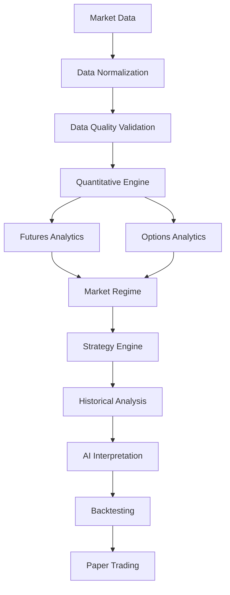
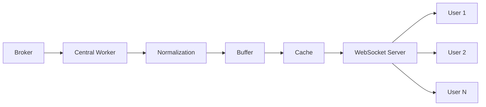

# Architecture: Droid - AI-Powered Indian F&O Market Analysis Platform

## 1. System Overview
The Droid platform is a private Indian F&O (Futures & Options) market analysis system designed for decision-support and research (not a prediction engine). 

**Key Characteristics:**
- **Target Audience:** Internal/private deployment (Maximum 10 users).
- **Core Purpose:** Advanced decision-support, research, and analysis of the Indian F&O market.
- **Architecture Style:** Modular monolith with dedicated background workers.
- **Cost Target:** ₹500–₹3,000/month.

## 2. High-Level Architecture Diagram


## 3. Technology Stack

| Layer | Technology |
|-------|----------|
| **Frontend** | Next.js 16 + React 19 + TypeScript + Tailwind CSS 4 + shadcn/ui |
| **Charts** | TradingView Lightweight Charts 5.2 |
| **Icons** | Lucide React |
| **Backend** | Python FastAPI + Pydantic v2 |
| **Database** | PostgreSQL/Supabase (future: TimescaleDB) |
| **Auth** | Supabase Auth (JWT) |
| **Cache** | In-memory (Redis optional later) |
| **Market Data** | MockProvider → Fyers/Upstox (Phase 2) |
| **AI** | OpenRouter/NVIDIA/Gemini/Local (Phase 8) |

## 4. Repository Structure

```text
e:\Droid\
├── backend/
│   ├── app/
│   │   ├── api/          # FastAPI routes
│   │   ├── core/         # Config, security, logging
│   │   ├── models/       # Pydantic schemas (API models)
│   │   ├── providers/    # Market data providers
│   │   └── services/     # Business logic
│   └── tests/            # pytest tests
├── frontend/
│   ├── src/
│   │   ├── app/          # Next.js App Router pages
│   │   ├── components/   # React components
│   │   │   ├── layout/   # Sidebar, Header, Ticker
│   │   │   ├── dashboard/# MarketCard, Chart, Breadth
│   │   │   ├── auth/     # AuthProvider
│   │   │   └── ui/       # shadcn/ui components
│   │   ├── hooks/        # Custom React hooks
│   │   └── lib/          # Utilities, API client, types
│   └── package.json
├── docs/                 # Documentation
├── .env.example
├── .gitignore
└── ARCHITECTURE.md
```

## 5. Market Data Provider Architecture

To ensure the quantitative engine remains decoupled from broker-specific structures, we implement a strict provider abstraction:

```text
MarketDataProvider (abstract)
    ├── MockProvider (Phase 1)
    ├── FyersProvider (Phase 2)
    └── UpstoxProvider (Phase 2)
```

**Normalized Models:**
- `NormalizedQuote`
- `NormalizedCandle`
- `NormalizedOptionQuote`

The quantitative engine processes only normalized data. It never depends on broker-specific response schemas or field names.

## 6. Future Centralized Market-Data Ingestion

While not implemented in Phase 1, the planned architecture for centralized data ingestion is designed as follows to support efficient broadcasting:



## 7. Authentication Architecture

- **Auth Provider:** Supabase Auth with JWT.
- **Environment Toggle:** `AUTH_REQUIRED` flag to easily bypass auth during local development.
- **Protection:** Protected API routes on the FastAPI backend using JWT validation.
- **Security:** No service-role secrets are ever exposed in the browser environment.

### JWT Flow

```
User → Next.js → Supabase Auth → JWT access token → FastAPI
→ Authorization: Bearer <token> → JWT validation → Authenticated request
```

FastAPI validates the token before accessing protected user-specific resources. The authenticated user ID is always derived from the validated JWT, never from a request body.

### Development/Demo Mode

- `APP_MODE=development` + `AUTH_REQUIRED=false`: Application works with MockProvider without Supabase
- `APP_MODE=production` + `AUTH_REQUIRED=true`: Requires Supabase authentication configuration
- Production fails safely with clear configuration error if auth is not configured

## 7.1 Supabase/PostgreSQL Integration (Phase 2)

### Architecture

```
                 Next.js
                    │
                    │ Supabase Auth (anon key)
                    ▼
              Supabase Auth
                    │
                   JWT
                    │
                    ▼
                 FastAPI
                    │
              Service Layer
                    │
                    ▼
             PostgreSQL/Supabase
              (service role key)
```

### Responsibilities

| Layer | Technology | Role |
|-------|-----------|------|
| Presentation | Next.js | UI, Supabase client for auth |
| API/Business Logic | FastAPI | JWT validation, service orchestration |
| Persistence | PostgreSQL/Supabase | User data, settings, watchlists |
| Market Data | MockProvider | Phase 2 market data source |

### Database Tables

- **profiles**: User profiles (references `auth.users.id`)
- **user_settings**: Per-user preferences (theme, defaults, providers)
- **watchlists**: User watchlists (multiple per user)
- **watchlist_items**: Instruments within watchlists
- **instruments**: Instrument metadata (reference data)
- **expiries**: Expiry date metadata

### Security

- **Row Level Security (RLS)** enabled on all user-owned tables
- **Service role key** is backend-only (bypasses RLS for admin operations)
- **Anon key** is browser-safe (respects RLS)
- **JWT validation** via python-jose with HS256
- **User ID** always derived from validated JWT

### Repository/Service Pattern

```
API → Service → Repository → PostgreSQL
```

- **API layer**: Route handlers, JWT validation, request/response models
- **Service layer**: Business logic, ownership checks
- **Repository layer**: Database queries via SQLAlchemy
- **Models**: Separate Pydantic schemas (API) and SQLAlchemy models (persistence)

## 8. API Design

Phase 1 endpoints provide health checks, auth status, and mock market data:

- `GET /health/live`
- `GET /health/ready`
- `GET /api/v1/health/market-data`
- `GET /api/v1/auth/profile`
- `GET /api/v1/markets/quotes`
- `GET /api/v1/markets/{symbol}/quote`
- `GET /api/v1/markets/{symbol}/candles`
- `GET /api/v1/markets/status`
- `GET /api/v1/markets/breadth`
- `GET /api/v1/markets/cards`

**Standard Response Envelope:**
```json
{
  "data": { ... },
  "error": null,
  "meta": {
    "provider": "mock",
    "timestamp": "2023-10-27T10:00:00Z",
    "status": "LIVE"
  }
}
```

## 9. Data Status System

The UI will clearly reflect the status of the data feed using the following hierarchy:

- **LIVE**: Real broker data flowing normally.
- **STALE**: Data older than configured threshold (possible connection drop).
- **DEMO**: MockProvider is active (development/testing).
- **DISCONNECTED**: No active data source connection.
- **ERROR**: Provider error occurred.

*Important:* The system will never display "LIVE" when the MockProvider is active.

## 10. Future Phase Architecture

- **Phase 2: Market Data:** Integration with Fyers/Upstox, WebSockets, and token lifecycle management.
- **Phase 3: High-Frequency Infrastructure:** Introduction of Redis, TimescaleDB, and circuit breakers.
- **Phase 4: Options:** Implementation of Black-76, Black-Scholes, Greeks, IV calculations, and Option chain.
- **Phase 5: Futures:** Analytics for Basis, OI positioning, and Rollover.
- **Phase 6: Market Regime:** Identifying Trend, Momentum, and Support/Resistance levels.
- **Phase 7: Strategy:** Strategy Builder, Payoff charts, and Strategy Scanner.
- **Phase 8: AI:** Structured output integration, Pydantic validation, and caching.
- **Phase 9: Historical Intelligence:** Similarity analysis and scenario generation.
- **Phase 10: Backtesting:** Factoring transaction costs, slippage, and historical contracts.
- **Phase 11: Paper Trading:** Virtual capital, order execution simulation, and P&L tracking.
- **Phase 12: Alerts and Refinement:** System tuning and user alerts.

## 11. Key Architecture Principles

1. **Provider-Independent Data Normalization:** Core services operate exclusively on internal standardized models.
2. **Strict Layering:** Frontend ↔ REST API ↔ Service Layer ↔ Provider Abstraction.
3. **Logic Placement:** Business logic resides in backend services, not within React components.
4. **Model Separation:** Pydantic schemas (validation/API) are kept separate from SQLAlchemy models (persistence).
5. **Reproducible Testing:** Deterministic mock data generation.
6. **Separation of Concerns:** Strict delineation between OBSERVED vs CALCULATED vs STATISTICAL vs MODEL vs AI INTERPRETATION data.
7. **Transparency:** Never display "LIVE" status when MockProvider is active.

## 12. Development Commands

```bash
# Backend
cd backend
python -m venv .venv
.venv\Scripts\pip install -e ".[dev]"
.venv\Scripts\uvicorn app.main:app --reload --port 8000
.venv\Scripts\pytest tests -v

# Frontend
cd frontend
npm install
npm run dev
npm run build
npm run lint
```

## 13. Environment Variables

See `.env.example` for the complete list. Key sections include Application settings, Server configuration, Authentication, Market Data switching, and feature flags for future phases (Database, Redis, AI).

## 14. Quantitative Methods (Future)

Planned quantitative methodologies include:
- **Black-76** for futures-priced European options.
- **Black-Scholes** for spot-based European options.
- **ACT/365** time-to-expiry with intraday precision.
- **Risk-free rate**: Current Indian benchmark → T-bill yield → 6.75% fallback.
- **Implied Volatility (IV)** via Brent's method.
- **Greek Normalization**: Theta per calendar day, Vega per IV point.
- **Transaction Costs**: Comprehensive modeling of STT, exchange charges, GST, SEBI fees, stamp duty, brokerage, and slippage.

## 15. AI Architecture (Future)

- **Provider Abstraction:** Supporting OpenRouter, NVIDIA, Gemini, and Local models.
- **Validation:** Enforcing structured output with Pydantic validation.
- **Data Flow:** AI → Analysis → Strategy → Paper Trading (Strictly: AI never communicates directly with Broker APIs).
- **Grounding:** Numeric grounding to prevent hallucinated market values.
- **Efficiency:** Caching (30-60s) and cost control mechanisms (~50 analyses/day).

## 16. Safety & Compliance Boundaries

- **Nature of System:** Decision-support platform, NOT guaranteed predictions.
- **Scope limitation:** Real-money live trading is out of scope for the MVP.
- **AI Boundaries:** AI cannot directly execute trades.
- **Compliance:** Regulatory review required before any potential future live trading features.
