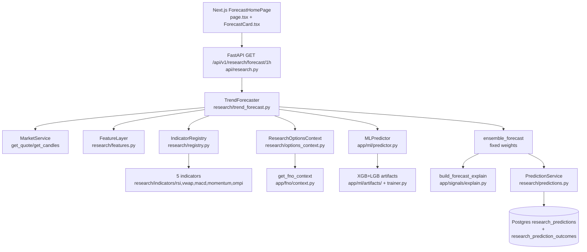

# 1-Hour Forecast — Current Framework, Architecture & Institutional-Grade Roadmap

> Status: `living spec` · Scope: `backend/app/research/trend_forecast.py` + ML + Research Lab + frontend forecast desk
> Audience: backend / quant / frontend. Complements `docs/ARCHITECTURE.md` and `docs/SIGNAL_GENERATION_PROCEDURE.md`.
> Convention: `file:line` references are to the tree at time of writing.

---

## 0. TL;DR

**Market Context** answers "where are we now" (regime, indicators, levels, VIX, F&O snapshot).
**1-Hour Forecast** answers "where next in the next 60 minutes, with what confidence, abort/target where".

Current 1H implementation (`TrendForecaster.forecast(horizon="1h")` in `backend/app/research/trend_forecast.py:476`):

```
7 TF candles (1m/5m/15m/30m/1h/4h/1D)
  → FeatureLayer per-TF features
  → 5 research indicators on 1h candles (rsi,vwap,macd,momentum,ompi)
  → ML 60m ensemble (XGBoost+LightGBM or heuristic fallback)
  → Options context (PCR/walls/max-pain/IV)
  → fixed-weight vote 0.30/0.30/0.25/0.10/0.05 → score ±100 → BULLISH≥+20 / BEARISH≤-20
  → target ±1.8×ATR, invalidation ±1.1×ATR
  → explain bundle + immutable ResearchPrediction
```

It is a **solid research scaffold** (PIT-aware models, immutable ledger, session-aware settlement, validation gate, calibrated-flag discipline) but **not institutional-grade**: fixed weights, 10-feature ML, heuristic options math, no probability calibration, no walk-forward cost-aware validation wired to promotion, no regime/session gating, no drift monitoring.

This doc records the current system faithfully (Part A) and specifies the upgrade to institutional grade (Part B).

---

## PART A — CURRENT FRAMEWORK IN FULL DETAIL

### A.1 Product definition

| Item | Current |
|---|---|
| Route | `GET /api/v1/research/forecast/{horizon}` in `backend/app/api/research.py:182` |
| Horizons | `1m/5m/15m/30m/1h` in `backend/app/research/trend_forecast.py:49` (`SUPPORTED_HORIZONS`). `1h` = `timeframe=1h, minutes=60, ml_minutes=60, ForecastHorizon.HORIZON_1H, horizon_candles=1, indicator_id=trend_forecast_1h` |
| Instruments | `NIFTY 50, BANKNIFTY, SENSEX` (frontend `frontend/src/app/(app)/page.tsx:13`, registry `backend/app/research/indicator_base.py:66`) |
| Frontend entry | `frontend/src/app/(app)/page.tsx:25 ForecastHomePage` → `api.getForecast(instrument, timeframe, true)` in `frontend/src/lib/api/intelligence.ts:37` → `ForecastCard` in `frontend/src/components/research/ForecastCard.tsx:79` + `WhyStrip` + `AIDeepInsightCard` + `SupportingSignalsPanel` + `ForecastOutcomes` |
| Output contract | `direction: BULLISH/BEARISH/NEUTRAL`, `score: -100..+100`, `confidence: 0..1`, `target_price/invalidation_price`, `layer_scores{mtf_alignment,indicators,ml,options,structure}`, `ml_forecast`, `indicator_outputs`, `mtf_features`, `options_context`, `explain`, `prediction_id` |
| Persistence | Optional `record=true` → `ResearchPrediction` via `PredictionService.record_prediction` in `backend/app/research/predictions.py:30` |
| Non-goals | No order generation, no position sizing, no live-trading execution. Decision-support only (see `docs/ARCHITECTURE.md:293`). |

`1m` is special: `ml_minutes=None`, ML layer degrades to neutral (`trend_forecast.py:50-57,275-282`). All other horizons request a per-horizon ML artifact.

### A.2 System context



Related but **architecturally separated**: production signal path (`docs/SIGNAL_GENERATION_PROCEDURE.md`, `app/signals/*`, `app/services/master_pipeline.py`) and Market Context path (`app/ai/context_builder.py`, `app/services/regime_service.py`). The forecast does **not** consume `MarketContext` directly today; it recomputes its own features from candles + F&O.

### A.3 Request lifecycle (7 steps, `TrendForecaster.forecast`)

Source: `backend/app/research/trend_forecast.py:476-573`.

1. **Resolve config** — `HORIZON_CONFIG["1h"]` → `timeframe=1h`, `ml_minutes=60`, `ForecastHorizon.HORIZON_1H`.
2. **Fetch MTF candles** — `fetch_multi_timeframe_candles` (`trend_forecast.py:120`): `asyncio.gather` over `FORECAST_TIMEFRAMES = [1m,5m,15m,30m,1h,4h,1D]` (`trend_forecast.py:32`), each `market_service.get_candles(instrument, timeframe=tf)` with `asyncio.wait_for(timeout=12.0)`. Failure → `[]` + `forecast_candle_fetch_failed` warning, not a hard fail. If primary `1h` empty → `ValueError("Insufficient 1h candle data...")` → API `503` (`api/research.py:199-203`), never synthetic. Resample fallback: if `1m` present but a higher TF missing, `_resample_dict_candles` aggregates OHLCV locally (`trend_forecast.py:150-177,179-234`).
3. **Options context** — `ResearchOptionsContext.get_context(instrument)` (`research/options_context.py:28`): wraps `app.fno.context.get_fno_context`. Returns `pcr_oi, pcr_vol, atm_iv, call_wall, put_wall, max_pain, days_to_expiry, atm_theta/gamma/vega, available, data_quality, raw_fno`. Unavailable → neutral defaults (`pcr 1.0, iv 15.0, walls None`) with `available=False`, `data_quality=EMPTY/FAILED`; synthetic → `DEGRADED`.
4. **MTF features** — `FeatureLayer.compute_multi_timeframe_features` (`research/features.py:252`): per-TF `compute_features` + `alignment{overall_bias, alignment_score, bull/bear/total_votes}`.
5. **Research indicators** — `run_research_indicators` (`trend_forecast.py:236`): for each id in `ENSEMBLE_INDICATOR_IDS = [rsi,vwap,macd,momentum,ompi]` (`trend_forecast.py:35`), `IndicatorRegistry.get(id)`, build `IndicatorContext(instrument, timeframe=1h, timestamp=now, candles=primary_candles, current_price, options_context, parameters={horizon})`, `await indicator.calculate(ctx)`, force `output.horizon/horizon_candles`. Failures skipped with warning.
6. **ML forecast** — `get_ml_forecast(instrument, 60)` (`trend_forecast.py:275`): `MLPredictor.predict_probabilities(symbol, horizon_minutes=60)` → `{bullish_pct, neutral_pct, bearish_pct, predicted_bias, trend_strength, confidence_score, model_source, calibrated}`. `None` horizon or exception → `None` (ML layer scores 0).
7. **Ensemble + record** — `ensemble_forecast(...)` (`trend_forecast.py:310`, §A.7) → `explain = build_forecast_explain(...)` (`app/signals/explain.py:445`) → if `record`: build `ResearchPrediction(prediction_id=forecast_1h_<hex>, indicator_id=trend_forecast_1h, version=1.0.0, ...)` and `PredictionService.record_prediction` (memory + optional DB insert, immutable, `predictions.py:30`).

### A.4 Data ingestion

* Provider: `MarketService` (broker-abstracted; see `docs/ARCHITECTURE.md:72`). Forecast normalizes via `_candle_to_dict` (`trend_forecast.py:95`): `{open,high,low,close,volume,timestamp}`.
* Concurrency: 7 parallel fetches, 12 s each; p95 bounded by single slowest call (comment `trend_forecast.py:125-131`).
* Degradation: missing TF → excluded from `per_timeframe`; `1m`-resampled TFs logged as `forecast_candle_resampled_fallback`. Explain surfaces `missing_timeframes/resampled_timeframes` (`app/signals/explain.py:544-575`).
* No tick/order-book: candles only. Same limitation as AI prompt path (`app/ai/prompt_builder.py:111-134`).

### A.5 FeatureLayer (`backend/app/research/features.py`)

`compute_features(instrument, timeframe, candles, options_ctx)` (`features.py:92`):

* **Session**: `classify_session_ist` (`features.py:27`): `OPENING 09:15-09:45, EARLY 09:45-11:30, MID 11:30-13:30, LATE 13:30-15:00, CLOSING 15:00-15:30, CLOSED` else. Uses candle timestamp, IST = UTC+5:30.
* **Quant** (`features.py:129-141`): `rsi_14, atr_14, adx/plus_di/minus_di, bollinger(upper/mid/lower/bandwidth/pct_b), supertrend(val/dir), ema_9/21/50/200, vwap (intraday cumulative, `calculate_intraday_vwap`), vwap_dist_pct`. Primitives from `app.quant.indicators`, TA suite from `app.technical_analysis.analyzer.analyze_timeframe` (guarded try/except).
* **Momentum dynamics**: `return_1/5/15_pct, acceleration (mom_now-mom_prev), realized_vol_pct (20-period log-return vol)`.
* **Volume dynamics**: `current/avg_20/relative_volume/is_volume_surge (≥1.8×)`.
* **Regime**: `determine_market_regime` (`features.py:64`): `ADX≥25 → TRENDING_UP/DOWN; else BB_bandwidth<1.0 → COMPRESSING; else ATR>0.8% spot → VOLATILE; else RANGING`. Enum `MarketRegime` in `research/enums.py:68`.
* **Options features**: `pcr_oi/vol, atm_iv, call/put_wall + distance_pct, max_pain, days_to_expiry, atm_theta` (only if `options_ctx.available`).
* PIT claim: uses only `candles[-1]` and prior (`features.py:99-103`).

`compute_multi_timeframe_features` (`features.py:252`): per-TF payloads under `per_timeframe`; alignment votes per TF: `BULLISH if supertrend==BULLISH and rsi≥50`, `BEARISH if supertrend==BEARISH and rsi<50`, else abstain. `overall_bias` = majority; `alignment_score = |bull-bear|/total×100`. Equal weight per TF; no horizon-specific weighting.

### A.6 Indicator ensemble

Contract: `IndicatorBase.calculate(context: IndicatorContext) -> IndicatorOutput` (`research/indicator_base.py:102`, models `research/models.py:48,62`). Registry: `IndicatorRegistry` (`research/registry.py:18`) with `register/get/list_all/get_by_category/lifecycle/sync_to_db`, autodiscovery via `app.research.indicators`. Lifecycle enum `EXPERIMENTAL..PRODUCTION..RETIRED` (`research/enums.py:14`).

The five ensemble members (all run **only on primary `1h` candles**):

| ID | File | Formula (current) | Output |
|---|---|---|---|
| `rsi` | `research/indicators/rsi_indicator.py:50` | `score=(RSI14-50)×2`, `BULL≥+10/BEAR≤-10`, `conf=|score|/80`, `tgt ±1.5×ATR / inval ±1.0×ATR` | `PRODUCTION` |
| `vwap` | `research/indicators/vwap_indicator.py` | distance from intraday VWAP + slope (see file) | score ±100 |
| `macd` | `research/indicators/macd_indicator.py` | MACD line/signal/histogram | score ±100 |
| `momentum` | `research/indicators/momentum_indicator.py` | returns/acceleration | score ±100 |
| `ompi` | `research/indicators/ompi.py` | options-momentum/positioning index | score ±100 |

Downstream the forecaster **simple-averages** them (`trend_forecast.py:331-341`): `ind_score=mean(score)`, `ind_confidence=mean(confidence)`. No weighting by lifecycle, regime, backtested edge, or correlation.

### A.7 ML ensemble (`backend/app/ml/*`)

* **Target spec** (`ml/targets.py:1`): versioned `TARGET_SPEC_VERSION="v1-atr-band"`. Label at `T` for horizon `H`: `fwd=(spot(T+H)-spot(T))/spot(T)`, `band=0.25×ATR(T)/spot(T)`; `fwd>+band→BULLISH(2)`, `<-band→BEARISH(0)`, else `NEUTRAL(1)`. `SUPPORTED_HORIZONS=(5,15,30,60,90,120)`, default 15. `60` flagged `may cross EOD — requires session-aware spot lookup` (`targets.py:75`). PIT rule documented in module docstring.
* **Features** (`ml/feature_extractor.py:6` + `ml/predictor.py:60`): exactly 10 normalized inputs — `rsi_norm, adx_strength, supertrend_signal, bollinger_pct_b, pcr_oi_deviation, max_pain_distance_pct, futures_basis_pct, price_above_ema20, price_above_sma200, pivot_position`. Inputs: `regime_service.get_technical_indicators/key_levels/vix_regime` + `options_service.get_option_chain_matrix` + quote. Note: `term_structure` is `None` in the live call today (`predictor.py:50-66`), so `futures_basis_pct` is effectively 0.
* **Model** (`ml/trainer.py:1`): per-horizon triple `(xgb_model_hH.json, lgb_model_hH.txt, meta_hH.json)` in `app/ml/artifacts/`; default `H=15` keeps legacy names. `train_ensemble` requires ≥100 rows, `stratify` split 80/20, XGB(100 trees, depth 5, lr 0.05, multi:softprob) + LGBM(100 trees), saves `metrics{xgb/lgb/ensemble accuracy, logloss}` + `horizon_minutes + target_spec_version + model_version` in meta. `ensemble_predict_proba` averages class probabilities → `(bear,neut,bull)%`. `load_ensemble` falls back to default-horizon artifacts if H-specific missing (caller must surface `calibrated=False`).
* **Inference** (`ml/predictor.py:26`): `validate_horizon → quote → indicators/key_levels → options chain → extract vector → ensemble_predict_proba(H)`. If artifact present: `model_source=xgboost_lightgbm_ensemble`, `calibrated = (meta.horizon==H and meta.spec==current)`. Else **heuristic fallback** (`predictor.py:116-144`): hand-weighted logit `0.25·ST+0.20·RSI+0.15·PCR+0.15·basis+0.15·EMA+0.10·pivot`, ADX-modulated softmax → percentages, `model_source=heuristic_ensemble`, `calibrated=False`. Then `trend_strength=|raw|×60+ADX×40`, `confidence=max_prob×1.1+ADX×10` clamped `[50,98]`, `predicted_bias` threshold `48%`, regime string, top-5 contributions, persist to `ml_predictions` via `MLRepository.save_prediction` (best-effort async).
* **Calibration today** (`ml/calibration.py:15`): `settle_prediction` (same ATR-band label) + `summarize_calibration` (hit-rate + avg confidence per `symbol×H×bias`, excluding other spec versions). No Platt/isotonic/temperature scaling, no reliability curves, no ECE/Brier wired into the forecast.

### A.8 Options layer

Adapter output (§A.3.3) is scored heuristically in `ensemble_forecast` (`trend_forecast.py:353-374`):

```python
opt = clip((pcr_oi-1.0)*80, -30, +30)            # PCR tilt
    + clip(pain_dist_pct*15, -20, +20)           # max-pain gravity
    - 20 if call_wall within +0.4% above spot
    + 20 if put_wall within -0.4% below spot
clip(opt, -100, +100)
```

Uses `atm_iv/theta/gamma/vega/dte` only as passthrough (features + explain), not in the score. No expected-move (`IV·√T`), no OI-change velocity, no PCR-volume vs OI divergence, no strike-concentration/GEX, no term-structure/basis.

### A.9 Ensemble math (current)

Source `trend_forecast.py:37-44,325-438`.

```python
LAYER_WEIGHTS = {mtf:0.30, indicators:0.30, ml:0.25, options:0.10, structure:0.05}
mtf = ±alignment_score (sign by overall_bias)
ind = mean(indicator scores)
ml  = bullish_pct - bearish_pct  (0 if ml None)
opt = heuristic above
struct = (±30 supertrend) + clip((rsi-50)*0.8, ±20)
final = Σ w·layer, clip ±100, round 2dp
confidence = mean(alignment_score/100, ind_conf, ml_conf)  # options/structure excluded
direction = BULLISH if final≥+20 else BEARISH if final≤-20 else NEUTRAL
atr = primary quant atr_14 or 0.5% spot
BULL: target=spot+1.8·ATR, inval=spot-1.1·ATR
BEAR: mirror. NEUTRAL: both None.
```

Known weaknesses (carried to Part B): weights fixed and sum to 1 only by construction; `structure` double-counts supertrend/RSI already in MTF+indicators; confidence ignores options/structure/disagreement; thresholds ignore regime/session/volatility; targets ignore options expected-move and session remainder.

### A.10 Explainability (`backend/app/signals/explain.py:445`)

`build_forecast_explain(ensemble_result, mtf_features, indicator_outputs, ml_forecast, options_ctx, current_price)` — pure, never throws, local import of `LAYER_WEIGHTS` to avoid cycle. Returns `{verdict{direction,confidence,state}, maths[{domain,score,weight,points,label}×5], penalties[], gates_passed[], inputs_snapshot{spot,vwap,rsi,adx,pcr,rel_vol,supertrend,max_pain,alignment}, why_layman[≤5], what_would_change_mind[≤3], data_health{missing/resampled/degraded/ml_available/indicator_count}, strategy_rule, weights_version="forecast-v1", threshold_armed=20.0, final_score}`. Frontend `WhyPanel` renders this with `layer_scores` fallback (`ForecastCard.tsx:281`).

### A.11 Persistence & audit

* `ResearchPrediction` (`research/models.py:103`): `{prediction_id, indicator_id=trend_forecast_1h, version=1.0.0, instrument, timeframe=1h, timestamp, current_price, direction, score, confidence, component_values{layer_scores, ml_forecast, indicator_ids, explain}, forecast_horizon=1h, horizon_candles=1, target/invalidation, snapshot_id=None, created_at}`. Immutable by convention (no UPDATE path).
* `PredictionService` (`research/predictions.py:23`): in-memory LRU (1000) + optional Postgres `research_predictions` INSERT; `append_outcome` → `research_prediction_outcomes ON CONFLICT(prediction_id) DO NOTHING`; `get/list` with DB→memory fallback.
* `PredictionOutcome` (`research/models.py:129`): `{outcome_id, prediction_id, actual_direction/move/pct, entry/exit, mfe/mae, target/stop_hit, time_to_target, is_correct, evaluated_at}`.
* `ResearchSnapshot` (`research/models.py:88`) exists but **is not written** on the forecast path today (gap).
* ML predictions persist separately to `ml_predictions` (`predictor.py:247`, `DATABASE.md:11`, migrations `003_*`).

### A.12 Validation, outcomes, settlement

* `OutcomeMeasurer.evaluate_forward_candles` (`research/outcome_measurer.py:22`): `actual_dir` from sign of last-close minus entry; MFE/MAE directional; chronological target-vs-stop touch; `is_correct = (pred==actual and not (stop and not target))`, `NEUTRAL` correct if `|pct|<0.10%`. `time_to_target ≈ (idx+1)*60s` (candle-resolution approximation).
* `CheapValidationGate.run_experiment` (`research/validation/backtest_engine.py:37`): PIT loop `candles[0:t+1]` → `indicator.calculate` → log prediction → quarantine `forward[t+1:t+1+H]` → `OutcomeMeasurer` → `StatisticalEvaluator.evaluate` vs empirical `NaiveMomentumBaseline` (`validation/baseline.py`). Params `warmup=30, stride=5`.
* `StatisticalEvaluator` (`research/validation/statistical_evaluator.py:47`): accuracy/precision/recall/F1, MFE/MAE means, win/loss, Wilson 95% CI, one-tailed z-test p-value vs baseline, `is_significant = p<0.05 and excess>0`, regime/session breakdowns → `ValidationReport` (`models.py:179`).
* Session-aware settlement (`ml/sessions.py:40`, `ml/settlement.py:58`): `classify_window(symbol, T, H)` → NSE requires `T` and `T+H` in **same regular session** (09:15-15:30 IST, trading day, non-special); else `INSUFFICIENT_DATA` (never bridge overnight gap). `resolve_forward_spot` = last 1m close in `[T,T+H]`; `plan_row` returns `settle/wait/skip`; `settle_due` settles `ml_predictions` where `outcome_label IS NULL`. Crypto 24/7 always settleable. **Gap**: no equivalent auto-settler is wired for `research_predictions` today.
* PIT/leakage primitives exist (`ml/pit_store.py:27` AS-OF joins + universe history; `ml/leakage_gate.py:38` CI gate) but are **not enforced** on the live forecast path.

### A.13 API & frontend

* `GET /api/v1/research/forecast/{horizon}?instrument=&record=` (`api/research.py:182`): validates horizon, delegates to singleton `trend_forecaster`, `503` on `ValueError` (insufficient data), `500` otherwise. Sibling endpoints: `chart/state`, `chart/features`, `options-context`, `indicators*`, `predictions*`, `experiments/run`, `snapshots`, `annotations` (`api/research.py:106-495`).
* `GET /api/v1/ml/predict` (see `app/api/ml.py:108`) exposes the ML layer standalone.
* Frontend: `ForecastHomePage` (`(app)/page.tsx:25`) holds `instrument/timeframe/forecast/loading/error/lastUpdated`, polls every 60 s, keeps last-good on transient error, clears on instrument/horizon switch. `ForecastCard.tsx:79` renders hero (score, confidence `Meter`, target/invalidation/spot, 5 layer bars, `WhyPanel` details). `intelligence.ts:37` is the typed client. `ForecastOutcomes` shows track record; `WhyStrip` shows context.

### A.14 Current constants cheat-sheet

| Constant | Value | File |
|---|---|---|
| `FORECAST_TIMEFRAMES` | `1m,5m,15m,30m,1h,4h,1D` | `trend_forecast.py:32` |
| `ENSEMBLE_INDICATOR_IDS` | `rsi,vwap,macd,momentum,ompi` | `trend_forecast.py:35` |
| `LAYER_WEIGHTS` | `0.30/0.30/0.25/0.10/0.05` | `trend_forecast.py:38` |
| Direction threshold | `±20` | `trend_forecast.py:416` |
| Target / inval | `1.8×ATR / 1.1×ATR` (indicators use `1.5/1.0`) | `trend_forecast.py:431` / `rsi_indicator.py:74` |
| Candle timeout | `12 s` per TF, concurrent | `trend_forecast.py:138` |
| Neutral ATR band | `0.25×ATR` | `ml/targets.py:34` |
| ML features | 10 names | `ml/trainer.py:29` |
| Frontend poll | `60 s` | `(app)/page.tsx:91` |

---

## PART B — INSTITUTIONAL-GRADE IMPLEMENTATION PLAN

### B.0 What "institutional grade" means here

1. **PIT-correct**: no look-ahead; AS-OF joins; leakage CI blocks promotion.
2. **Probabilistic & calibrated**: `P(bull/bear/neut)`, Brier/log-loss/ECE reported; confidence = calibrated probability, not a vote average.
3. **Session & regime aware**: different behaviour in OPENING vs CLOSING, expiry day, high-VIX; abstains when edge is absent.
4. **Validated edge**: walk-forward, purged, cost-aware; beats naive baselines with `p<0.05` over ≥200 settleable samples; weights learned OOS, not hand-set.
5. **Risk-defined**: targets/invalidations from volatility + options expected-move + session remainder, not fixed ATR multiples.
6. **Monitored & auditable**: every forecast has a snapshot; drift/calibration dashboards; auto-degrade on decay.
7. **Operable**: p95 latency SLO, caching, idempotency, versioned contracts.

Out of scope (unchanged): no auto-execution; research/decision-support only.

### B.1 Phased roadmap

| Phase | Goal | Exit criteria |
|---|---|---|
| **P0 Honesty** (days) | Stop overstating; surface quality | `calibrated/data_quality/settleable` in API+UI; late-session downgrade; snapshot written |
| **P1 Measurement** (1-2 wks) | Prove/disprove edge for 1h | Walk-forward report: hit-rate, Brier, ECE, MFE/MAE, target-hit, costs; auto-settlement for research preds |
| **P2 Model** (2-4 wks) | Learned stacking + 60m-native ML + options v2 | OOS meta-learner beats fixed weights; `h60` artifact calibrated; ECE halved |
| **P3 Risk & Ops** (2 wks) | Tradeable, monitored output | Regime/session gates, EM-based targets, drift auto-disable, SLO + dashboards |

#### P0 — Honesty & auditability (no model change)

* **B0.1 Surface truth**: extend `GET /forecast/1h` response with `{model_source, calibrated, data_quality, missing_timeframes, resampled_timeframes, settleable, settle_reason, session, dte, artifact_version(target_spec+meta)}`. Frontend badge: `LIVE / DEGRADED / HEURISTIC / UNSETTLEABLE (late session)`. Files: `trend_forecast.py:440,538`, `api/research.py:182`, `ForecastCard.tsx:127`, `explain.py:569`.
* **B0.2 Late-session downgrade**: if `classify_window(NSE, now, 60).settleable==False` (i.e. after ~14:30 IST), cap confidence at 0.45 and add penalty `"crosses-session-close — 1h window unsettleable"`. Never show `High conviction` there.
* **B0.3 Snapshot every forecast**: write `ResearchSnapshot{snapshot_id, mtf_features, options_ctx, data_quality}` and set `prediction.snapshot_id`. Endpoint exists (`POST /snapshots`); wire it into `forecast()`.
* **B0.4 Regime-gated thresholds**: `±20` → matrix: `RANGING/COMPRESSING: ±35`, `VOLATILE: ±30 + confidence×0.8`, `TRENDING_*: ±20`. `ADX<20` forces at least `VALIDATED`-style language. Prevents choppy-market false conviction.
* Acceptance: manual QA matrix (live/degraded/missing-TF/late-session/closed) shows correct badges; every `prediction_id` has a `snapshot_id`.

#### P1 — Measurement (prove edge before tuning)

* **B1.1 Research auto-settler**: clone `ml/settlement.py:93 settle_due` for `research_predictions` (same `classify_window` + `resolve_forward_spot` on 1m). Cron/apscheduler hourly + on-demand `POST /predictions/{id}/measure` already exists. Backfill last 90 days of `trend_forecast_1h` rows where settleable.
* **B1.2 Walk-forward protocol** (extend `CheapValidationGate`): for `1h` only — `warmup=100 1h candles`, `stride=1`, session-filtered (drop windows crossing close), purged gap of `H` between train/test folds, 5 folds. Report per fold + pooled: `n, hit-rate + Wilson CI, baseline (naive momentum + buy-hold), excess, p-value, Brier, log-loss, ECE (10 bins), MFE/MAE, target-hit/stop-hit/time-to-target, avg return net of `quant/costs.py` + 0.05% spread`. Gate: promote only if `pooled excess>0, p<0.05, ECE<0.08, n≥200`.
* **B1.3 Attribution**: ablation (drop-one-layer ΔBrier), pairwise layer correlation, per-indicator `StatisticalEvaluator` split by `regime×session`. Decides P2 weights; likely outcome: down-weight `structure` (collinear), up-weight `ml` when `calibrated`.
* **B1.4 Calibration baseline**: plot reliability curve of current `confidence` vs empirical hit-rate; publish `summarize_calibration`-style table per `bias×regime×session`. Expected finding: overconfidence in `RANGING/CLOSING` — motivates B2.3.
* Acceptance: `docs` report with tables + committed backtest script + CI check that fails if new weights degrade pooled Brier.

#### P2 — Model (learned, 60m-native, options-aware)

* **B2.1 Feature set v2 (ML + stacking)**: expand 10 → ~35, all PIT:
  * MTF: `supertrend_dir_15m/1h/4h, rsi_15m/1h, ema_stack_1h, bb_pct_b_1h, atr_pct_1h`
  * Dynamics: `ret_1/5/15, acceleration, realized_vol_20, parkinson_vol, rel_volume_20, vwap_dist, poc_distance`
  * Session/calendar: `session_onehot(5), minutes_to_close, dte_bucket, expiry_day_flag, day_of_week`
  * Volatility: `atm_iv, iv_rank_proxy, iv_vs_realized, vix, vix_chg`
  * F&O: `pcr_oi/vol + divergence, max_pain_dist, call/put_wall_dist, oi_change_pct, futures_basis, rollover_pace`
  * Regime: `adx, bb_bandwidth, regime_onehot`
  Files: `ml/feature_extractor.py`, `research/features.py` (expose to ML), `trainer.FEATURE_NAMES`.
* **B2.2 True h60 artifact**: build same-session dataset (`sessions.classify_window` filter at row-build time), `neutral_band` sensitivity `{0.20,0.25,0.35}`, time-series split (no shuffle), `scale_pos_weight` for imbalance, early stopping on log-loss, save `xgb_model_h60.json/lgb_model_h60.txt/meta_h60.json` with `target_spec_version + n_samples + metrics + feature_names + git_sha`. Remove silent fallback-to-h15 for H=60 in `load_ensemble` (fail loud → `calibrated=False` + `model_source=heuristic_ensemble` surfaced).
* **B2.3 Probability calibration**: per-`(H=60, regime, session)` isotonic (or temperature) map fitted on OOS folds; store `calibrator_h60_{regime}_{session}.json`. Forecast returns `P={bull,neut,bear}` calibrated + `confidence=max(P)` + `ECE/Brier` of the calibrator version. `confidence` never exceeds raw agreement when calibrator says otherwise.
* **B2.4 Learned stacking (replace fixed weights)**: meta-learner (L2 logistic or GBM, ≤50 params) trained on OOS layer scores → `P(bull)`. Inputs: 5 layer scores + `regime + session + dte + iv_rank + missing_TF_count`. Output replaces `final_score` sign logic: `direction = argmax(P) if max(P)≥threshold(regime,session) else NEUTRAL`. Version as `forecast-weights-v2` in `component_values` + `explain.weights_version`. Keep `forecast-v1` codepath behind flag for A/B.
* **B2.5 Options v2 score**: `expected_move = atm_iv/100×spot×sqrt(dte/365)` (use `options-intelligence/expected-move` if available); `opt = w1·pcr_z + w2·(oi_change) + w3·(wall_pressure with distance decay, not 0.4% cliff) + w4·(max-pain gravity scaled by 1/dte)`, all z-scored on 60-day rolling. Weights from B2.4, not hand-set.
* **B2.6 Targets v2**: `target = spot ± min(1.8·ATR_1h, 0.7·EM)`, `inval = spot ∓ max(1.1·ATR_1h, 0.35·EM, structure_barrier)`; shrink both by `time_to_close/H` in CLOSING; `NEUTRAL` returns a range `{mid, upper=spot+0.5·EM, lower=spot-0.5·EM}` instead of `None` so the UI can show "expected chop".
* Acceptance: OOS pooled Brier/ECE improve ≥20% vs v1; `h60` `calibrated=true` live; ablation shows each layer contributes.

#### P3 — Risk, gating & operations

* **B3.1 Gate matrix** (hard rules, evaluated before direction):
  | Condition | Action |
  |---|---|
  | `CLOSED` / non-trading day | `503` (existing) |
  | `OPENING` first 15 m or `CLOSING` last 30 m | confidence cap `0.55`, targets ×0.7 |
  | `DTE≤1` or `EXPIRY_DAY` | options weight ×0.5, add penalty |
  | `VIX expansion >+8%` or `VOLATILE` regime | require `max(P)≥0.60` else `NEUTRAL` |
  | `missing TF≥2` or `resampled 1h` | `DEGRADED`, cap `0.50` |
  | `ML unavailable` | cap `0.55` + penalty (existing text) |
* **B3.2 Monitoring**: nightly job computes rolling-200 `hit-rate, Brier, ECE, PSI` per feature + `layer-weight stability`; dashboards + alerts (Telegram/log). Auto-degrade: if pooled `p≥0.10` or `ECE>0.12` over last 200 settleable → force `calibrated=false`-style caps + page. Leakage CI (`leakage_gate`) runs on every training PR; `PITStore.as_of_join` becomes the training-row builder (not just a primitive).
* **B3.3 Performance & contract**: cache `MTF candles 30 s / options 60 s / ML 15 s` per instrument; request idempotency key (`instrument+H+minute_bucket`); p95 `<8 s`, timeout budget `12 s` retained; version API payload (`forecast_version: 1h-v2`, `weights_version`, `target_spec_version`, `model_version`, `calibrator_version`). DB migration: `research_predictions.component_values` gains `P{}`, `session`, `regime`, `settleable`; new table `research_forecast_snapshots`; index `(indicator_id, instrument, timestamp)`.
* **B3.4 Frontend v2**: probability bars (`bull/neut/bear%`), `Expected chop range` for NEUTRAL, `Why` shows calibrated vs raw confidence, settleability + session countdown ("unsettles after 14:30"), track-record tab filtered to settleable + costs.
* Acceptance: SLO dashboard green 7 days; drift runbook tested (simulate stale F&O → DEGRADED badge + caps); backtest-with-costs Sharpe/return reported alongside hit-rate.

### B.2 Test & rollout plan

* Unit: `targets.label_forward_return` boundaries; `sessions.classify_window` (open/mid/late/close/holiday/special); `resample` OHLCV invariants; `ensemble` v1/v2 parity fixtures; `explain` never-throws fuzz.
* Integration: `forecast(record=False)` with mocked `MarketService` (live/degraded/empty-1h) + mocked F&O; assert badges/caps/503 paths.
* Offline: walk-forward script `backend/scripts/validate_forecast_1h.py` (new) → markdown report; CI gate on Brier regression.
* Shadow: run v2 alongside v1 (`record=true`, `indicator_id=trend_forecast_1h_v2`) for 2 weeks; promote only on P1 gate.
* Rollback: flag `FORECAST_WEIGHTS_VERSION=v1|v2`; v1 codepath retained.

### B.3 File map (where to change what)

| Area | Files |
|---|---|
| Orchestrator | `backend/app/research/trend_forecast.py` (config, fetch, ensemble, record) |
| Features | `backend/app/research/features.py`, `backend/app/quant/indicators.py`, `backend/app/technical_analysis/analyzer.py` |
| Indicators | `backend/app/research/indicators/*.py`, `indicator_base.py`, `registry.py`, `models.py`, `enums.py` |
| ML | `backend/app/ml/predictor.py`, `feature_extractor.py`, `trainer.py`, `targets.py`, `calibration.py` (+ new `calibrators.py`), `sessions.py`, `settlement.py`, `pit_store.py`, `leakage_gate.py` |
| Options | `backend/app/research/options_context.py`, `backend/app/fno/context.py`, `backend/app/services/options_service.py` |
| Explain/persist | `backend/app/signals/explain.py`, `backend/app/research/predictions.py`, `outcome_measurer.py`, `validation/*` |
| API | `backend/app/api/research.py`, `backend/app/api/ml.py` |
| DB | `database/migrations/*`, `backend/app/models/database.py`, `repositories/ml_repository.py` |
| Frontend | `frontend/src/app/(app)/page.tsx`, `components/research/ForecastCard.tsx`, `components/forecast/WhyPanel.tsx`, `components/dashboard/ForecastOutcomes.tsx`, `lib/api/intelligence.ts` |
| Docs | `docs/ARCHITECTURE.md`, `docs/SIGNAL_GENERATION_PROCEDURE.md`, `docs/DATABASE.md`, this file |

### B.4 Glossary

* **PIT**: point-in-time — inference at `T` sees only data published ≤`T`.
* **Settleable**: `[T,T+H]` lies in one NSE regular session so `T+H` price exists without overnight bridging.
* **ATR-band label**: `±0.25×ATR` dead zone around zero forward return (`TARGET_SPEC_VERSION v1-atr-band`).
* **ECE/Brier**: expected calibration error / mean squared probability error — calibration quality, not just accuracy.
* **Stacking**: meta-model over layer scores, trained out-of-sample.

### B.5 Open questions (record decisions here)

1. Keep `1.8/1.1 ATR` as fallback when options EM unavailable? Proposed: yes, flagged `target_basis=ATR-only`.
2. Include `4h/1D` votes for `1h` horizon or restrict MTF to `≤1h`? Proposed P2 experiment: horizon-weighted votes.
3. Train one `h60` model for all indices or per-instrument? Proposed: per-instrument if `n≥2000`, else shared + instrument one-hot.

---

*End. Update this file with each phase gate result (date, metrics, artifact hashes, decision).*
