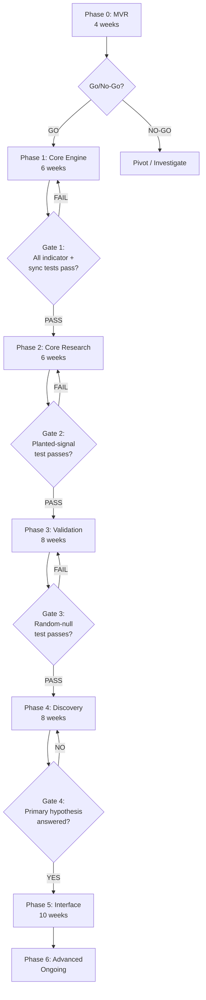
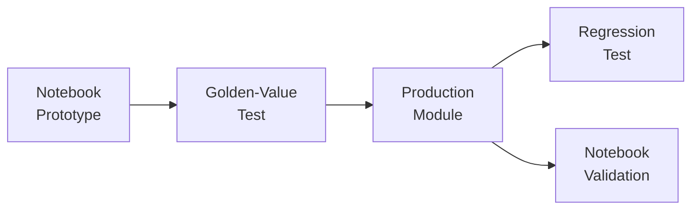

# DROID — MACD + FISHER-9 EXHAUSTION RESEARCH v4

## REVISED IMPLEMENTATION PLAN

> This document is a **revision layer** on top of the original v3 specification.
> All 54 sections of v3 remain in force unless explicitly superseded below.
> New sections are numbered 55–61. Modified sections reference their v3 number.

---

## CHANGE LOG FROM v3 → v4

| Gap | v3 Score Loss | v4 Resolution | Section |
|---|---|---|---|
| Scope creep / no MVR | –3 | Phase 0 MVR + hard time gates | §55, §51R |
| Fisher-9 implementation unpinned | –2 | Pinned reference + formula | §10R |
| Instruments too narrow | –1 | Acknowledged + expansion roadmap | §3R, §56 |
| No power analysis | –1 | Power framework added | §57 |
| Divergence underspecified | –0.5 | Expanded mini-spec | §23R |
| No friction model | –0.5 | Friction-aware outcome layer | §58 |
| Typo (ABALATION) | — | Fixed | §36R |
| Frontend over-scoped | — | Prioritized build order | §44R |

---

## §10R — FISHER-9: PINNED REFERENCE IMPLEMENTATION

### Supersedes v3 §10 partially. All v3 §10 requirements remain; this section adds specificity.

#### Pinned Reference

The Fisher Transform implementation for DROID is **Ehlers' original Fisher Transform**
as published in:

> John F. Ehlers, *Cybernetic Analysis for Stocks and Futures*, Wiley, 2004, Chapter 4.

#### Exact Formula (float64)

```
Period = 9

For each completed bar:

  1. MaxH = Highest(High, Period)
     MinL = Lowest(Low, Period)

  2. Price = (High + Low) / 2.0   // HL2

  3. Raw = 0.33 * 2.0 * ((Price - MinL) / (MaxH - MinL) - 0.5) + 0.67 * Raw[1]

     // On first bar with sufficient history: Raw[1] = 0.0

  4. Clamp Raw to (-0.999, +0.999)
     // Prevents log(0) or log(negative)

  5. Fisher = 0.5 * ln((1 + Raw) / (1 - Raw)) + 0.5 * Fisher[1]

     // On first bar with sufficient history: Fisher[1] = 0.0

  6. Trigger = Fisher[1]
```

#### Initialization

| Variable | Initial Value | Notes |
|---|---|---|
| `Raw[1]` | `0.0` | Before first valid bar |
| `Fisher[1]` | `0.0` | Before first valid bar |
| Minimum bars required | `Period` (9) | Before first valid output |

#### What "Period = 9" Means

The period controls the lookback for `Highest(High, 9)` and `Lowest(Low, 9)`.
It does **not** refer to an EMA period or a smoothing constant.

#### Smoothing Constants

| Constant | Value | Purpose |
|---|---|---|
| `0.33` | Normalization smoothing weight | Current bar contribution |
| `0.67` | Normalization smoothing carry | Previous bar carry (1 - 0.33) |
| `0.5` (in Fisher line) | Output smoothing | Blends current with prior Fisher |

#### Golden-Value Fixture Requirement

Create a fixture of **at least 50 bars** of known OHLC data with hand-verified Fisher and Trigger
outputs computed using the formula above at float64 precision.

The fixture must include:

- Normal market conditions (mid-range Fisher values)
- Extreme positive Fisher values (> +1.5)
- Extreme negative Fisher values (< –1.5)
- A Fisher zero crossing
- A Fisher-Trigger crossover
- A Fisher-Trigger crossunder
- The initialization period (first 9 bars)

> [!IMPORTANT]
> If the DROID project has historically used a **different** Fisher variant (e.g., TradingView's
> Pine `ta.fisher` which uses slightly different smoothing), that variant must be documented here
> with its exact formula, and the golden fixture must match **that** variant. The formula above
> is the default. Any deviation must be an explicit, versioned configuration change.

#### Price Source Configuration

| Parameter | Default | Allowed |
|---|---|---|
| `fisher_price_source` | `HL2` | `HL2`, `HLC3`, `OHLC4`, `Close` |

Changing the price source creates a new `config_version_hash`.

---

## §3R — INSTRUMENTS: LIMITATION ACKNOWLEDGMENT AND EXPANSION ROADMAP

### Supersedes v3 §3.

#### Initial Instruments (Unchanged)

```
NIFTY
BANKNIFTY
SENSEX
```

#### Acknowledged Limitation

> [!WARNING]
> NIFTY, BANKNIFTY, and SENSEX are structurally correlated Indian equity indices.
> NIFTY–SENSEX correlation is typically ≥ 0.97. BANKNIFTY–NIFTY correlation is typically ≥ 0.85.
>
> **Cross-instrument validation across these three does NOT constitute independent replication.**
>
> Any result that "works on all three" has an effective instrument count closer to **1.5–2.0**,
> not 3.0. All cross-instrument statistics must reflect this.

#### Effective Instrument Count

When pooling across instruments, apply the following correction:

```
effective_instruments = N_instruments / (1 + (N_instruments - 1) * avg_pairwise_correlation)
```

Where `avg_pairwise_correlation` is computed from daily return correlations over the analysis period.

Report `effective_instruments` alongside `raw_instruments` in every cross-instrument result.

#### Expansion Roadmap (Not Required for Phase 0–3)

| Tier | Instruments | Purpose | Phase |
|---|---|---|---|
| Tier 0 (Current) | NIFTY, BANKNIFTY, SENSEX | Initial hypothesis testing | 0–3 |
| Tier 1 | FINNIFTY, MIDCPNIFTY | Same market, different sectors | 4+ |
| Tier 2 | Individual stocks (RELIANCE, HDFCBANK, TCS, INFY, ICICIBANK) | Single-name validation | 4+ |
| Tier 3 | S&P 500, NASDAQ-100, DAX | Structurally independent markets | 5+ |
| Tier 4 | Gold, Crude Oil, USD/INR | Non-equity asset classes | 6+ |

> [!NOTE]
> Tier 3+ instruments provide the only true independent replication test.
> A pattern that survives Tier 0–2 but fails Tier 3 may be an artifact of Indian market microstructure
> rather than a universal indicator property.

#### Instrument Addition Rules

1. Adding a new instrument requires no code changes — only data pipeline configuration.
2. New instruments must go through the full Phase 0 validation (golden values, look-ahead test).
3. New instruments do **not** retroactively invalidate existing results.
4. Cross-instrument statistics must be recomputed when new instruments are added.

---

## §23R — DIVERGENCE DETECTION: EXPANDED MINI-SPEC

### Supersedes v3 §23. This is a significant expansion.

#### Why Divergence is Hard

Divergence detection depends on **pivot identification**, which is:

1. Highly parameter-sensitive (different pivot lookbacks yield different pivots)
2. Subject to look-ahead bias (a pivot is only confirmed after N right-side bars)
3. Ambiguous (multiple valid pivot pairs can exist simultaneously)
4. Fractal (pivots exist at every scale)

This section specifies the exact pivot and divergence logic to eliminate ambiguity.

#### Pivot Definition

A **pivot high** at bar `i` is confirmed when:

```
High[i] >= High[j]  for all j in [i - left_bars, i + right_bars], j ≠ i
```

A **pivot low** at bar `i` is confirmed when:

```
Low[i] <= Low[j]  for all j in [i - left_bars, i + right_bars], j ≠ i
```

Default parameters:

| Parameter | Default | Configurable Range |
|---|---|---|
| `pivot_left_bars` | 5 | 2–20 |
| `pivot_right_bars` | 5 | 2–20 |

#### Pivot Confirmation Timing

> [!CAUTION]
> A pivot at bar `i` with `right_bars = 5` is **not confirmed until bar `i + 5` closes**.
>
> The pivot's `event_timestamp` = `bar_close_ts` of bar `i + right_bars`.
>
> The pivot's `pivot_timestamp` = `bar_close_ts` of bar `i` (the actual extremum).
>
> Research queries must use `event_timestamp`, not `pivot_timestamp`.

#### Divergence Types

**Regular Bearish Divergence:**

```
Price:  pivot_high[current] > pivot_high[previous]
AND
Indicator: indicator_at_pivot[current] < indicator_at_pivot[previous]
```

Where indicator = MACD value OR Fisher value.

**Regular Bullish Divergence:**

```
Price:  pivot_low[current] < pivot_low[previous]
AND
Indicator: indicator_at_pivot[current] > indicator_at_pivot[previous]
```

**Hidden Bearish Divergence:**

```
Price:  pivot_high[current] < pivot_high[previous]
AND
Indicator: indicator_at_pivot[current] > indicator_at_pivot[previous]
```

**Hidden Bullish Divergence:**

```
Price:  pivot_low[current] < pivot_low[previous]
AND
Indicator: indicator_at_pivot[current] < indicator_at_pivot[previous]
```

#### Pivot Pairing Rules

When multiple pivot highs (or lows) exist, the system must resolve which pair to use:

| Rule | Default | Description |
|---|---|---|
| `max_pivot_separation` | 100 bars | Maximum bars between the two pivots |
| `min_pivot_separation` | 5 bars | Minimum bars between the two pivots |
| `pivot_pairing_strategy` | `nearest` | `nearest`: most recent valid pair. `strongest`: largest price/indicator gap. `all`: emit all valid pairs |

#### Indicator Value at Pivot

The indicator value associated with a pivot is:

```
indicator_value = indicator[pivot_timestamp]
```

NOT `indicator[event_timestamp]`. The indicator value at the actual extremum is what matters
for measuring divergence. But the divergence **event** is only emitted at `event_timestamp`.

#### Divergence Quality Metrics

For each detected divergence, store:

| Metric | Description |
|---|---|
| `price_delta` | Absolute price difference between pivots |
| `price_delta_atr` | Price delta normalized by ATR |
| `indicator_delta` | Absolute indicator difference between pivots |
| `pivot_separation_bars` | Number of bars between the two pivots |
| `divergence_angle` | Slope difference (price slope minus indicator slope) |
| `confirmation_lag` | Bars from actual pivot to confirmation |

#### Divergence Interaction with Dual Extreme

Divergence is a **research modifier**, not a standalone event in this module.

The primary research question regarding divergence is:

> Does the presence of divergence at the time of a dual-extreme event improve the
> forward outcome compared to dual-extreme events without divergence?

Store a boolean `divergence_present_at_event` on each dual-extreme episode, along with
the divergence type and quality metrics.

#### Parameter Sensitivity for Divergence

Divergence results are known to be sensitive to pivot parameters. The parameter
sensitivity test (v3 §35) must include:

```
pivot_left_bars:  [3, 5, 7, 10]
pivot_right_bars: [3, 5, 7, 10]
max_pivot_separation: [50, 100, 150]
```

If results change direction with small parameter changes, flag as `FRAGILE_DIVERGENCE`.

---

## §36R — ABLATION EXPERIMENTS (TYPO FIX + CLARIFICATION)

### Supersedes v3 §36. Corrects "ABALATION" → "ABLATION".

Section title: **ABLATION EXPERIMENTS**

All content from v3 §36 remains unchanged except the spelling correction.

Additionally, the ablation must report results in a standardized table:

```
| Stage          | N    | n_eff | Baseline | Lift   | 95% CI       | q-value | Direction |
|----------------|------|-------|----------|--------|--------------|---------|-----------|
| A. MACD only   | ...  | ...   | ...      | ...    | [... , ...]  | ...     | ...       |
| B. Fisher only | ...  | ...   | ...      | ...    | [... , ...]  | ...     | ...       |
| C. Dual        | ...  | ...   | ...      | ...    | [... , ...]  | ...     | ...       |
| D. + Exhaust.  | ...  | ...   | ...      | ...    | [... , ...]  | ...     | ...       |
| E. + Ind.Conf. | ...  | ...   | ...      | ...    | [... , ...]  | ...     | ...       |
| F. + Price Cf. | ...  | ...   | ...      | ...    | [... , ...]  | ...     | ...       |
```

The `Direction` column indicates whether the incremental lift from the previous stage is:

- `POSITIVE` — adding this stage improves the relationship
- `NEUTRAL` — no measurable change
- `NEGATIVE` — adding this stage degrades the relationship
- `INSUFFICIENT` — sample too small to determine

---

## §44R — FRONTEND: PRIORITIZED BUILD ORDER

### Supersedes v3 §44 partially. All sections remain; this adds explicit build priority.

> [!IMPORTANT]
> The frontend has 14 sections. Building all 14 simultaneously is a scope trap.
> The following priority order ensures the most research-critical views ship first.

#### Priority 1 — MVP Research Interface (Phase 5a)

These 4 views directly answer the primary hypothesis:

| # | Section | Justification |
|---|---|---|
| 1 | Pattern Comparison (§48) | Directly shows ablation results — the #1 experiment |
| 2 | Statistical Validation (§12/§30) | Shows N, n_eff, CI, baselines — required for interpretation |
| 3 | Historical Research (§6) | Allows browsing raw research results |
| 4 | Baseline Comparison (§7/§24) | Shows whether edge exceeds baseline — the core question |

#### Priority 2 — Exploration Interface (Phase 5b)

These views support deeper investigation:

| # | Section | Justification |
|---|---|---|
| 5 | Event Timeline (§5/§47) | Visual verification of individual events |
| 6 | Failure Analysis (§8/§27) | Understanding when/why pattern fails |
| 7 | Price + MACD + Fisher Chart (§2/§46) | Visual confirmation of indicator behavior |
| 8 | MTF State Matrix (§1/§45) | Multi-timeframe overview |

#### Priority 3 — Advanced Research (Phase 5c)

| # | Section | Justification |
|---|---|---|
| 9 | Divergence Analysis (§9/§23R) | Research modifier, not core |
| 10 | Sequence Research (§11/§22) | Advanced pattern exploration |
| 11 | Pattern Builder (§10/§49) | Custom query construction |
| 12 | Dual Extreme Scanner (§3) | Live scanning utility |
| 13 | Exhaustion Scanner (§4) | Live scanning utility |
| 14 | Saved Patterns / Export (§13-14) | Persistence and sharing |

> [!TIP]
> Priority 1 can be built as a **static report generator** (HTML/PDF) before investing
> in a full interactive dashboard. This gets research answers faster.

---

## §55 — PHASE 0: MINIMUM VIABLE RESEARCH (NEW SECTION)

> [!IMPORTANT]
> This is the most significant addition in v4. Phase 0 exists to answer the primary
> hypothesis **as fast as possible** before investing in infrastructure.

### Purpose

Produce a definitive preliminary answer to:

> "Does dual MACD + Fisher-9 extremeness followed by exhaustion contain measurable
> information about subsequent price movement?"

…using a Jupyter notebook, before building any database, UI, or production pipeline.

### Phase 0 Deliverables

| # | Deliverable | Description |
|---|---|---|
| 0.1 | Golden-value notebook | Validates MACD and Fisher-9 against pinned formulas (§10R) |
| 0.2 | Single-instrument, single-timeframe ablation | NIFTY, 5m, full ablation A–F |
| 0.3 | Look-ahead proof | Perturbation test on the notebook pipeline |
| 0.4 | Random-null test | Run pipeline on synthetic random walk — must find nothing |
| 0.5 | Planted-signal test | Inject known effect — pipeline must recover it |
| 0.6 | Preliminary ablation table | The standardized table from §36R |
| 0.7 | Go/No-Go decision | Based on 0.6 results |

### Phase 0 Constraints

- **No database** — use pandas DataFrames / Parquet files
- **No UI** — Jupyter notebook with matplotlib/plotly charts
- **No incremental computation** — batch only
- **No MTF** — single timeframe (5m default)
- **Single instrument** — NIFTY only
- **No divergence, no sequence matching, no regime splits**
- **Float64 throughout**

### Phase 0 Timeline Target

```
Week 1:  Deliverables 0.1 (golden values)
Week 2:  Deliverables 0.2 (core indicator + event detection + forward outcomes)
Week 3:  Deliverables 0.3–0.5 (validation tests)
Week 4:  Deliverables 0.6–0.7 (ablation table + decision)
```

**Total: 4 weeks maximum.**

### Phase 0 Go/No-Go Decision

After completing 0.6, evaluate:

| Outcome | Decision |
|---|---|
| Ablation shows consistent incremental lift at each stage, CI excludes zero | **GO** — proceed to Phase 1 |
| Mixed results — some stages help, some don't, moderate significance | **CONDITIONAL GO** — proceed to Phase 1 but reduce scope (drop stages that show no lift) |
| Random-null test produces similar "significance" levels | **NO-GO** — the methodology has a bug or the effect doesn't exist. Investigate before proceeding |
| No measurable lift at any stage, or lift indistinguishable from baseline | **PIVOT** — the hypothesis as stated does not hold for this instrument/timeframe. Test alternatives before investing in infrastructure |

> [!CAUTION]
> **Resist the temptation to skip Phase 0.** If the primary hypothesis fails on NIFTY 5m
> in a well-controlled notebook experiment, building a production database and 14-section
> dashboard will not make it succeed.

---

## §51R — REVISED PHASING WITH HARD GATES AND TIME BUDGETS

### Supersedes v3 §51.



### Phase Details

#### Phase 0 — MINIMUM VIABLE RESEARCH *(4 weeks)*

See §55 above.

**Gate 0:** Go/No-Go decision documented with evidence.

---

#### Phase 1 — CORE ENGINE *(6 weeks)*

Implement:

| Week | Deliverable |
|---|---|
| 1–2 | 1m data reader from DROID spine, market calendar integration |
| 2–3 | Higher timeframe resampling with session-aware bar construction |
| 3–4 | MACD (with all derived features from §8), Fisher-9 (pinned formula from §10R) |
| 4–5 | Adaptive MACD extremes (§9), Fisher zones both modes (§11) |
| 5 | State layer (§12), AS-OF join framework (§6), HTF age tracking |
| 6 | Look-ahead perturbation test, golden-value tests, incremental=batch test |

**Database tables created:** `mtf_indicator_candles`, `mtf_indicator_states`, `mtf_indicator_config_versions`

**Gate 1 Checklist:**

- [ ] MACD golden values match within float64 tolerance
- [ ] Fisher-9 golden values match within float64 tolerance (against §10R fixture)
- [ ] Higher timeframe values appear only after candle close
- [ ] Look-ahead perturbation test passes
- [ ] Incremental output == batch output within tolerance
- [ ] Session-aware resampling passes edge cases (half-days, Muhurat, first/last bar)
- [ ] All 7 timeframes produce valid output for all 3 instruments

---

#### Phase 2 — CORE RESEARCH *(6 weeks)*

Implement:

| Week | Deliverable |
|---|---|
| 1 | Dual-extreme event detection (§13), episode model (§19) |
| 2 | Exhaustion detection (§14), indicator reversal tracking (§15) |
| 3 | Price confirmation (§16), inverse event (§18) |
| 4 | Forward outcome engine (§25), MFE/MAE, continuous returns |
| 5 | First-passage barriers (§26), failed event storage (§27) |
| 6 | Planted-signal test (§38 TEST 2), synthetic validation |

**Database tables created:** `mtf_indicator_events`, `mtf_indicator_outcomes`

**Gate 2 Checklist:**

- [ ] Dual-extreme events correctly detected (manual verification of 20+ events)
- [ ] Episodes correctly de-duplicated
- [ ] Failed/expired events are stored, not deleted
- [ ] Forward outcomes are deterministic (same input → same output)
- [ ] MFE/MAE calculations match hand-computed examples
- [ ] First-passage barrier logic handles all edge cases (same-bar double-touch, unresolved)
- [ ] Planted-signal test recovers known effect direction and approximate magnitude
- [ ] Inverse (oversold) events detected symmetrically

---

#### Phase 3 — SCIENTIFIC VALIDATION *(8 weeks)*

Implement:

| Week | Deliverable |
|---|---|
| 1 | MACD-only baseline (B4), Fisher-only baseline (B5) |
| 2 | Dual baseline (B6), exhaustion baseline (B7), progressive baselines B0–B3 |
| 3 | Stage ablation (§36R) with standardized output table |
| 4 | Effective N calculation (§31), trading-day clustering, cross-instrument clustering |
| 5 | Block bootstrap (§32), 95% CI computation |
| 6 | Null simulation (§32), regime-preserving permutation |
| 7 | FDR / Benjamini-Hochberg (§33), trial registry |
| 8 | Chronological train/validation/holdout split (§34), sealed holdout mechanism |

**Database tables created:** `mtf_indicator_research_runs`, `mtf_indicator_trials`

**Gate 3 Checklist:**

- [ ] Random-null test does NOT systematically produce false edges
- [ ] Baselines B0–B9 all compute correctly
- [ ] Ablation table shows incremental lift with CI for each stage
- [ ] Effective N < raw N (clustering is working)
- [ ] Bootstrap CIs are reasonable (not degenerate)
- [ ] FDR adjustment is applied; trial count is tracked
- [ ] Holdout split is chronological; holdout data is sealed
- [ ] All statistical results show N, n_eff, baseline, lift, CI, q-value

**Decision Point After Gate 3:**

The primary hypothesis can now be **preliminarily answered**. Document:

1. Does the relationship exist? (lift direction and CI)
2. How strong? (effect size in ATR units)
3. Which stages contribute? (ablation table)
4. Does it survive validation split? (validation results)
5. Is it distinguishable from chance? (null simulation comparison)

If the answer is "no detectable relationship" at this point, **stop and document the null result**
before proceeding to Phase 4. A null result is a valid research outcome.

---

#### Phase 4 — DISCOVERY *(8 weeks)*

Implement:

| Week | Deliverable |
|---|---|
| 1–2 | MTF research framework (§20–21), AS-OF MTF state views |
| 3 | Sequence matcher (§22) |
| 4 | Divergence detection (§23R) with full pivot logic |
| 5 | Regime analysis (§28), session analysis (§29) |
| 6 | Failure analysis (§27) with descriptive tags |
| 7 | Parameter sensitivity (§35) with FRAGILE detection |
| 8 | Power analysis (§57), instrument correlation adjustment (§3R) |

**Database tables created:** `mtf_indicator_divergence`, `mtf_indicator_patterns`

**Gate 4:** Primary hypothesis answered with full supporting evidence across timeframes,
regimes, and sessions.

---

#### Phase 5 — RESEARCH INTERFACE *(10 weeks)*

Build in priority order per §44R:

| Weeks | Priority | Sections |
|---|---|---|
| 1–4 | P1: MVP Research Interface | Pattern Comparison, Statistical Validation, Historical Research, Baseline Comparison |
| 5–7 | P2: Exploration Interface | Event Timeline, Failure Analysis, Charts, MTF Matrix |
| 8–10 | P3: Advanced Research | Divergence, Sequence, Pattern Builder, Scanners, Export |

**Gate 5:** All 30 acceptance tests from v3 §52 pass.

---

#### Phase 6 — ADVANCED RESEARCH *(Ongoing)*

- Walk-forward analysis
- Advanced null models
- Tier 1–4 instrument expansion (§3R)
- Friction-aware analysis (§58)
- Advanced clustering
- AI/ML research integration (only after statistical foundation is validated)

---

### Total Timeline Summary

| Phase | Duration | Cumulative |
|---|---|---|
| Phase 0: MVR | 4 weeks | 4 weeks |
| Phase 1: Core Engine | 6 weeks | 10 weeks |
| Phase 2: Core Research | 6 weeks | 16 weeks |
| Phase 3: Validation | 8 weeks | 24 weeks |
| Phase 4: Discovery | 8 weeks | 32 weeks |
| Phase 5: Interface | 10 weeks | 42 weeks |
| Phase 6: Advanced | Ongoing | — |

**Time to first hypothesis answer:** ~4 weeks (Phase 0)
**Time to rigorous hypothesis answer:** ~24 weeks (Phase 3)
**Time to full research system:** ~42 weeks (Phase 5)

---

## §56 — CROSS-INSTRUMENT INDEPENDENCE FRAMEWORK (NEW SECTION)

### Purpose

Ensure that cross-instrument results are not inflated by correlation.

### Implementation

#### 1. Pairwise Correlation Matrix

At the start of each research run, compute and store:

```python
for each pair (instrument_a, instrument_b):
    correlation = pearson(daily_returns_a, daily_returns_b)
    store in mtf_indicator_research_runs.instrument_correlations
```

#### 2. Effective Instrument Count

```python
avg_corr = mean(all pairwise correlations)
n_eff_instruments = n_instruments / (1 + (n_instruments - 1) * avg_corr)
```

For the initial set (NIFTY, BANKNIFTY, SENSEX), expect:

```
avg_corr ≈ 0.90
n_eff_instruments ≈ 3 / (1 + 2 * 0.90) ≈ 1.07
```

#### 3. Cross-Instrument Pooling Rules

| Scenario | Adjustment |
|---|---|
| Reporting per-instrument results | No adjustment needed |
| Pooling events across instruments | Apply cross-instrument clustering to n_eff |
| Claiming "works across instruments" | Require consistent direction across all instruments individually |

#### 4. Independence Tiers

| Tier | Description | Effective Independence |
|---|---|---|
| Same index family (NIFTY, SENSEX) | Near-zero independence | ~0.05 |
| Same market, different sector (BANKNIFTY vs NIFTY) | Low independence | ~0.15–0.25 |
| Same country, different asset (NIFTY vs Gold/INR) | Moderate independence | ~0.4–0.6 |
| Different country equity (NIFTY vs S&P500) | High independence | ~0.7–0.85 |
| Different asset class (NIFTY vs Crude Oil) | Highest independence | ~0.8–0.95 |

Report the effective independence tier in cross-instrument results.

---

## §57 — STATISTICAL POWER ANALYSIS FRAMEWORK (NEW SECTION)

### Purpose

Before running experiments, determine whether the data contains enough events
to detect a meaningful effect. After running experiments, determine whether
a null result is due to "no effect" or "insufficient power."

### Minimum Detectable Effect Size

Define the smallest effect worth detecting:

| Metric | Minimum Meaningful Effect | Rationale |
|---|---|---|
| ATR-normalized forward return | 0.15 ATR | Below this, the effect is too small to be practically useful |
| First-passage success rate lift | 5 percentage points over baseline | Below this, incremental information is negligible |
| Directional accuracy lift | 3 percentage points over 50% | Below this, indistinguishable from noise |

These are configurable defaults. The researcher may adjust them.

### Required Sample Size Calculation

Before each experiment, compute and display:

```python
from scipy.stats import norm

def required_n(effect_size, baseline_std, alpha=0.05, power=0.80):
    z_alpha = norm.ppf(1 - alpha / 2)
    z_beta = norm.ppf(power)
    n = ((z_alpha + z_beta) * baseline_std / effect_size) ** 2
    return int(np.ceil(n))
```

Display:

```
Required n_eff for this experiment: 245
Available n_eff: 180
⚠ UNDERPOWERED — insufficient events to detect an effect of 0.15 ATR
  with 80% power at α = 0.05.
  Consider: pooling timeframes, extending data range, or accepting
  that only larger effects can be detected.
```

### Power Categories

| Available n_eff vs Required | Label | Action |
|---|---|---|
| ≥ 100% of required | `ADEQUATELY_POWERED` | Results interpretable as stated |
| 50–99% of required | `MARGINALLY_POWERED` | Flag; null results may be false negatives |
| 25–49% of required | `UNDERPOWERED` | Strong warning; null results not trustworthy |
| < 25% of required | `SEVERELY_UNDERPOWERED` | Do not draw conclusions; increase data or pool |

### Post-Hoc Power

After every experiment that yields a non-significant result, compute observed power:

```
Given the observed effect size and variance, what was the probability
of detecting the effect at α = 0.05?
```

Display alongside the result:

```
Result: No significant edge detected (p = 0.23)
Post-hoc power: 0.34
Interpretation: With only 34% power, this null result should NOT be
interpreted as "no effect exists." The experiment was too small to tell.
```

### Integration with Ablation

The ablation table (§36R) must include a power column:

```
| Stage          | N    | n_eff | Power | Baseline | Lift   | 95% CI       | q-value |
|----------------|------|-------|-------|----------|--------|--------------|---------|
| A. MACD only   | 412  | 89    | 0.72  | ...      | ...    | [... , ...]  | ...     |
| B. Fisher only | 380  | 82    | 0.68  | ...      | ...    | [... , ...]  | ...     |
| ...            |      |       |       |          |        |              |         |
```

### Minimum Reporting Threshold

Results with `n_eff < 20` must not be reported as findings. They may be displayed
with the label `INSUFFICIENT_SAMPLE` but must never appear in summary tables
without that qualifier.

---

## §58 — FRICTION-AWARE OUTCOME LAYER (NEW SECTION)

### Purpose

While this remains a research system (not a trading system), understanding whether
an observed effect survives realistic execution friction adds research value.

### Scope

> [!NOTE]
> This is NOT a P&L simulator. This is a **friction sensitivity test** that answers:
> "Would the observed effect be economically meaningful after typical costs?"

### Implementation

Add an **optional** friction-adjusted outcome alongside the raw outcome.

#### Default Friction Parameters

| Parameter | Default (Index Futures) | Default (Spot Index) | Configurable |
|---|---|---|---|
| `spread_atr_fraction` | 0.02 ATR | N/A (not tradable) | Yes |
| `slippage_atr_fraction` | 0.03 ATR | N/A | Yes |
| `round_trip_cost_atr` | 0.05 ATR | N/A | Yes |

For spot indices (NIFTY, SENSEX, BANKNIFTY as indices):

```
No friction adjustment — these are not directly tradable.
Friction analysis applies only when continuous_futures price basis is used.
```

#### Friction-Adjusted Metrics

For each forward outcome, compute:

```
friction_adjusted_return = raw_return - round_trip_cost_atr
friction_adjusted_mfe = raw_mfe - (spread_atr_fraction + slippage_atr_fraction)
friction_adjusted_mae = raw_mae  // MAE is already adverse — no adjustment
```

#### Friction Sensitivity Report

| Metric | Raw | After 0.05 ATR | After 0.10 ATR | After 0.15 ATR |
|---|---|---|---|---|
| Mean forward return | +0.18 ATR | +0.13 ATR | +0.08 ATR | +0.03 ATR |
| First-passage success | 58% | 55% | 51% | 48% |
| Lift over baseline | +7pp | +5pp | +2pp | –1pp |

This allows the researcher to see how robust the edge is to friction assumptions.

#### Rules

1. Raw (frictionless) outcomes are always the **primary** research output.
2. Friction-adjusted outcomes are always **secondary** and clearly labeled.
3. Friction parameters are stored in `config_version_hash`.
4. Friction analysis is available from Phase 4 onward (not required for Phase 0–3).

---

## §59 — NOTEBOOK-FIRST DEVELOPMENT PROTOCOL (NEW SECTION)

### Purpose

Enforce the principle that every research computation must work in a notebook
before being productionized into the database/UI pipeline.

### Protocol



| Step | Description |
|---|---|
| 1. Notebook Prototype | Implement the computation in a Jupyter notebook using pandas/numpy |
| 2. Golden-Value Test | Verify against hand-computed or reference values |
| 3. Production Module | Port to the production codebase (database-backed, incremental-capable) |
| 4. Regression Test | Automated test ensuring production output matches notebook output |
| 5. Notebook Validation | Re-run the notebook against production output for visual verification |

### Notebook Standards

- All notebooks are stored in `research/notebooks/`
- Each notebook has a clear title and date
- Notebooks must be re-runnable from scratch (no hidden state)
- Notebooks must specify their data version and config version
- Notebooks are **not** production code — they are research artifacts

---

## §60 — DECISION REGISTER (NEW SECTION)

### Purpose

Track every significant research decision with its rationale, so that future
researchers (or the same researcher months later) understand why choices were made.

### Format

Every major decision is recorded in a `DECISIONS.md` file:

```markdown
## DEC-001: Fisher-9 Reference Implementation

**Date:** YYYY-MM-DD
**Decision:** Use Ehlers 2004 original formula with 0.33/0.67 smoothing
**Alternatives Considered:**
  - TradingView ta.fisher (different smoothing)
  - AmiBroker Fisher (different clamp)
**Rationale:** Ehlers original is the canonical reference; other implementations
  are approximations. Golden values will be computed from this formula.
**Reversible:** Yes, with new config_version_hash
**Status:** Active
```

### Mandatory Decision Points

The following decisions MUST be recorded before implementation:

| # | Decision |
|---|---|
| DEC-001 | Fisher-9 reference implementation choice |
| DEC-002 | MACD EMA initialization method |
| DEC-003 | ATR calculation method (SMA vs EMA for first period) |
| DEC-004 | Pivot detection parameters for divergence |
| DEC-005 | Episode de-duplication rules |
| DEC-006 | First-passage same-bar double-touch resolution |
| DEC-007 | Chronological split date boundaries |
| DEC-008 | Effective N clustering method |
| DEC-009 | Price basis choice (spot vs continuous futures) |
| DEC-010 | Session boundary handling for overnight gaps |

---

## §61 — RISK REGISTER (NEW SECTION)

### Purpose

Explicitly track risks that could derail the project.

| # | Risk | Likelihood | Impact | Mitigation |
|---|---|---|---|---|
| R1 | Primary hypothesis is false | Medium | High | Phase 0 Go/No-Go gate; null result is valid |
| R2 | Insufficient data for statistical power | Medium | High | Power analysis (§57); acknowledge limitations |
| R3 | Scope creep delays core research | High | High | Hard phase gates; Phase 0 MVR |
| R4 | Fisher implementation mismatch | Low | Critical | Pinned formula (§10R); golden-value fixture |
| R5 | Look-ahead bias in implementation | Medium | Critical | Perturbation test; AS-OF enforcement |
| R6 | Multiple-testing inflation | High | Medium | FDR control; trial registry; honest reporting |
| R7 | Overfitting to NIFTY | Medium | Medium | Instrument expansion roadmap (§3R); acknowledged limitation |
| R8 | Data quality issues in 1m spine | Low | High | Data validation in Phase 1; anomaly detection |
| R9 | Divergence parameter sensitivity | High | Low | FRAGILE flag; parameter sensitivity test |
| R10 | Phase 5 (UI) consumes remaining budget | Medium | Medium | Priority order (§44R); static reports as fallback |

---

## COMPLETE ACCEPTANCE CRITERIA (v4)

All 30 criteria from v3 §52 remain. The following are added:

| # | Criterion | Source |
|---|---|---|
| 31 | Phase 0 Go/No-Go decision is documented with evidence | §55 |
| 32 | Fisher-9 implementation matches pinned formula (§10R) exactly | §10R |
| 33 | Cross-instrument correlation is computed and reported | §56 |
| 34 | Effective instrument count is reported in cross-instrument results | §56 |
| 35 | Power analysis is computed for every experiment | §57 |
| 36 | Underpowered results are flagged, not presented as findings | §57 |
| 37 | Friction-adjusted outcomes available for futures price basis | §58 |
| 38 | Every major decision is recorded in DECISIONS.md | §60 |
| 39 | All risks in risk register have active mitigations | §61 |
| 40 | Divergence detection uses confirmation-aware pivot timing | §23R |
| 41 | Pivot parameter sensitivity is tested and FRAGILE flag works | §23R |
| 42 | Frontend builds in priority order (P1 before P2 before P3) | §44R |

---

## SUMMARY OF WHAT CHANGED

### Structural Additions
1. **Phase 0 (MVR)** — Answer the hypothesis in 4 weeks before building infrastructure
2. **Power Analysis** — Know whether your sample is large enough before running experiments
3. **Friction Layer** — Understand economic meaningfulness of detected edges
4. **Decision Register** — Track why choices were made
5. **Risk Register** — Explicitly manage project risks

### Specification Tightening
6. **Fisher-9 pinned** — Exact formula, constants, initialization, all documented
7. **Instruments acknowledged** — Correlation-adjusted effective count, expansion tiers
8. **Divergence expanded** — Full pivot specification, pairing rules, confirmation timing
9. **Frontend prioritized** — Research-critical views first, scanners last
10. **Phasing hardened** — Time budgets, gate checklists, explicit Go/No-Go

### Philosophy

The v3 spec was excellent at describing **what** to build.

The v4 revision adds **when** to build it, **when to stop**, and **what to do if the hypothesis fails**.

> [!TIP]
> The most valuable output of this entire system may be a well-documented null result.
> "We rigorously tested whether dual MACD + Fisher-9 exhaustion predicts reversals
> and found no statistically significant edge after controlling for baselines and
> multiple testing" is worth more than a hundred backtests that confirm the author's bias.
